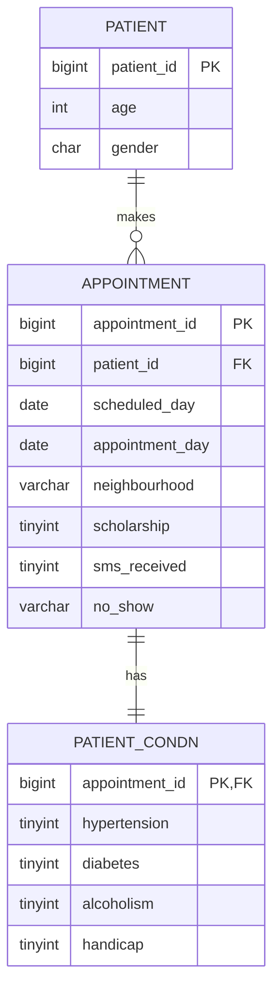
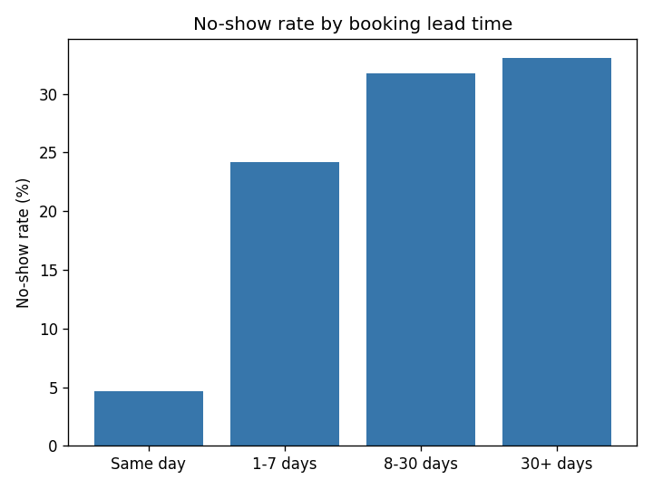

# Patient No-Show & Chronic Condition Analysis

Analyzing healthcare appointment data to understand which factors are associated with patients missing their scheduled visits

## Problem Statement

Do patients with chronic conditions like diabetes and hypertension attend appointments differently than other patients? This project looks at whether chronic illness status predicts no-show behavior, with the goal of helping hospitals figure out which patient groups might need targeted outreach  like care coordinators, home visits, or telehealth options  to improve treatment adherence. It also looks at supporting factors like SMS reminders and booking lead-time to see where scheduling policy could help reduce missed appointments.

## Dataset

This project uses the Kaggle "Medical Appointment No Shows" dataset (Brazilian public healthcare system, ~110,527 appointment records).
Source: https://www.kaggle.com/datasets/joniarroba/noshowappointments

**Note on the data file:** The raw CSV isn't included in this repo (excluded via `.gitignore` due to file size and licensing). Download it from the Kaggle link above and place it in the `sql/` folder before running the data load step.

## Tech Stack

- MySQL 8.0
- Docker
- DBeaver

## Repository Structure

hospital-noshow-analysis/
├── README.md
├── docker-compose.yml
├── .gitignore
├── sql/
│ ├── 01_schema.sql
│ ├── 02_load_data.sql
│ └── 03_queries.sql
└── findings/
├── findings.md
└── images/
└── lead_time_chart.png

## ER Diagram



## How to Run

**Data loading note:** The CSV needs to be downloaded from Kaggle and imported into a `staging_raw` table first (using DBeaver's Import Data feature, or `LOAD DATA INFILE`), since the raw CSV structure doesn't match the final 3-table schema. This manual step happens between running `01_schema.sql` and the insert statements in `02_load_data.sql`.

### Option A — Docker (recommended)

Start the database container:

```bash
docker compose up -d
```

Connect using DBeaver or any MySQL client:

- Host: `localhost:3306`
- Database: `hospital_noshow`
- User: `root`
- Password: `rootpass`

### Option B — No Docker (fallback)

Manual setup via XAMPP/phpMyAdmin or MySQL Workbench:

1. Import `sql/01_schema.sql`
2. Complete the manual data loading step described above
3. Import `sql/02_load_data.sql`

## Key Queries & What They Answer

- **Q1 — Overall no-show rate:** What percentage of all appointments end up as a no-show?
- **Q2 — Diabetes vs no-show rate:** Do diabetic patients miss appointments more or less than non-diabetics?
- **Q3 — Hypertension vs no-show rate:** Does having hypertension affect how likely a patient is to show up?
- **Q4 — SMS reminder effect:** Are patients who get an SMS reminder more likely to attend?
- **Q5 — Booking lead-time effect:** Does the gap between booking date and appointment date affect attendance?
- **Q6 — Age group effect:** Which age groups have the highest and lowest no-show rates?

Full queries are in [`sql/03_queries.sql`](sql/03_queries.sql).

## Findings Summary

| Metric               | Result                                                                        |
| -------------------- | ----------------------------------------------------------------------------- |
| Overall no-show rate | 20.19%                                                                        |
| Diabetes             | 18.0% (with) vs 20.36% (without)                                              |
| Hypertension         | 17.3% (with) vs 20.9% (without)                                               |
| SMS reminder         | 27.57% (received) vs 16.7% (not received)                                     |
| Lead time            | 4.65% (same day) → 24.15% (1-7 days) → 31.72% (8-30 days) → 33.03% (30+ days) |
| Age group            | Under 18: 21.91%, 18-35: 23.83%, 36-55: 19.69%, 55+: 16.64%                   |

Full reasoning and interpretation for each of these is in [`findings/findings.md`](findings/findings.md).



The chart above shows the clearest pattern in the data — no-show rate rises sharply the further in advance an appointment is booked.

**Note:** These are correlations found in the data, not confirmed cause-and-effect relationships further statistical testing would be needed to validate them beyond this exploratory analysis.

## Real-World Relevance

These attendance patterns aren't unique to this dataset. Public healthcare systems in Asia like India's OPD system or the Philippines' PhilHealth clinics  deal with similar high patient volumes and appointment attendance challenges. Being able to identify which patient groups are more likely to miss appointments could help these systems target outreach more effectively and use limited resources better.
